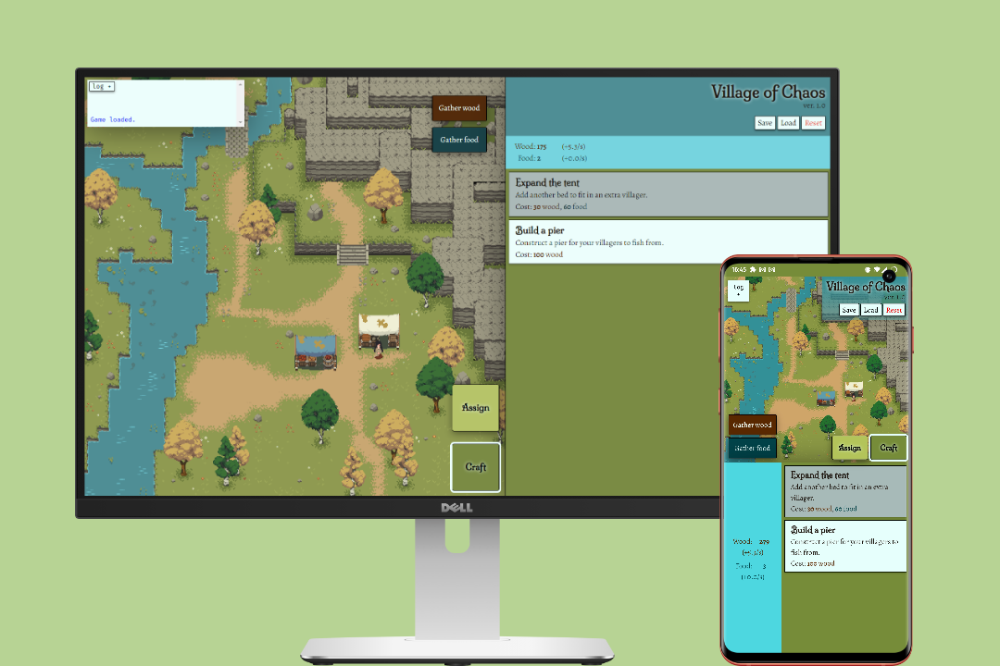
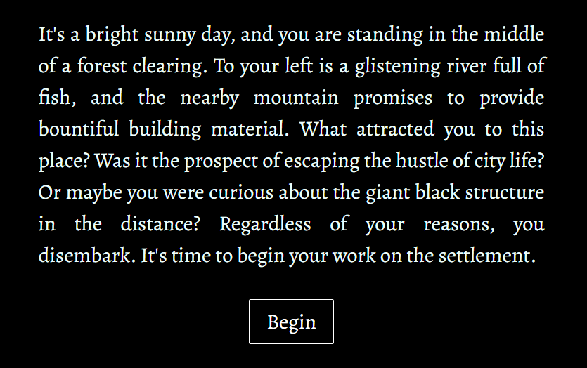
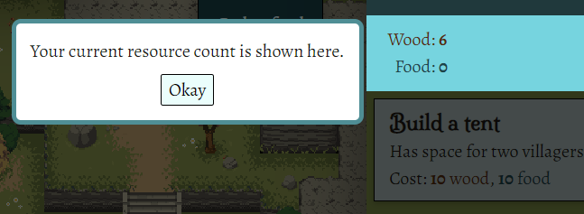
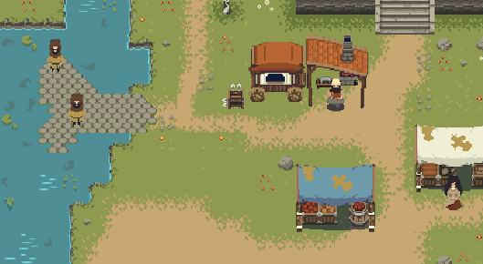
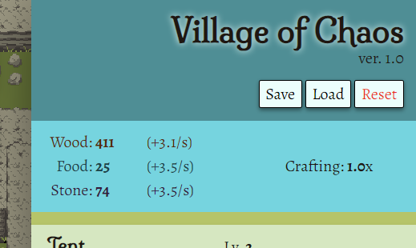
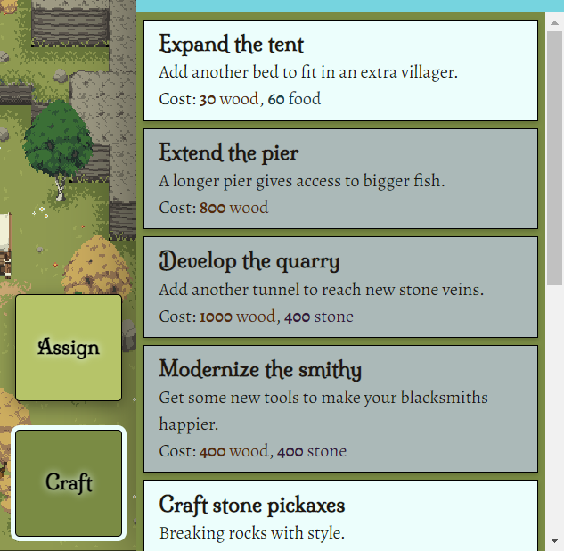
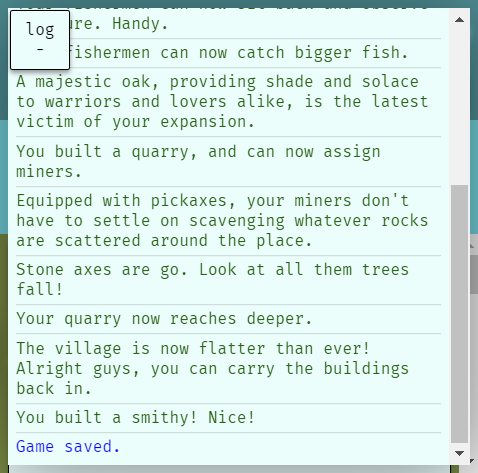
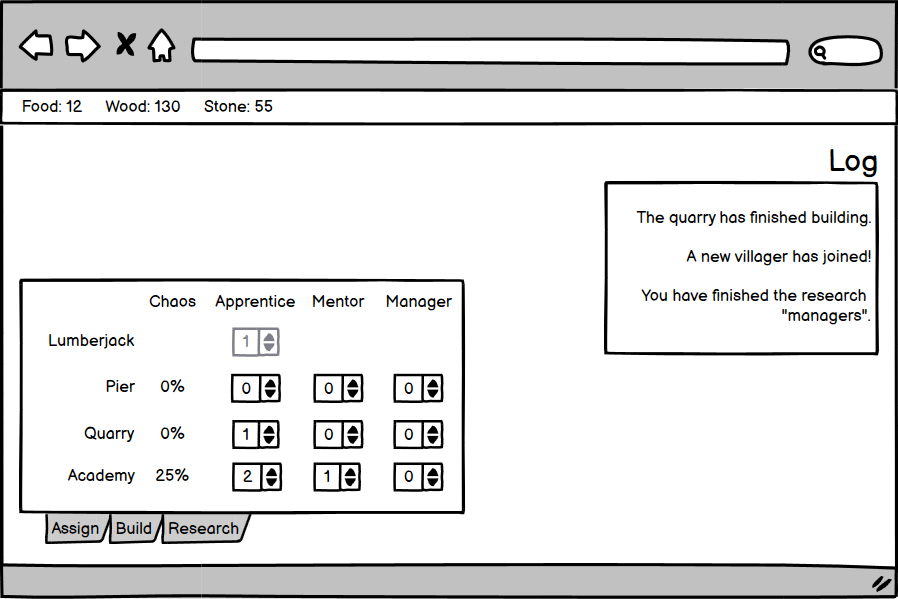

# Village of Chaos: a browser game

_Village of Chaos_ is an incremental game written in vanilla Javascript, made for [Code Institute](https://codeinstitute.net)'s 2nd submission project. The goal of the game is to build a village, bit by bit, and manage your villagers' jobs to maximize their potential.

[Live version is available here.](https://tearnote.github.io/village-of-chaos/)

## Important notes

The game has a saving feature. It autosaves every 5 minutes, but make sure to save manually if you're about to close the game so that you don't lose the last few minutes of progress.

The documentation is split across three files:

-   [README.md](README.md) (this file): Overview of the game. Read this to get an idea of the basic premise, technologies used and project conventions.
-   [DESIGN.md](doc/DESIGN.md): UX design notes crafted during early stages of development. The design process is described entirely, from the concept and market research, through information structuring to visual design principles and color palettes.
-   [TESTING.md](doc/TESTING.md): Testing procedures. The game has been automatically validated and manually tested with procedures noted down in this file.

## Highlights

The game begins with a story passage, which is also featured later during progression.

The game guides the player through the basic features as they become available, via tutorial pop-ups that highlight the relevant element.

The game's background image represents the player's village's currently erected buildings, manned by animated villager sprites.

The header display's the player's resources, as well as controls over the saving feature.

The tabbed interface allows for buying upgrades using collected resources, and assigning villagers to jobs.

The expandable log window allows the player to see the latest events that happened in their village.

## Technologies

-   HTML5
    -   Semantic tags used whenever applicable,
    -   [Images](#attribution) served as WebP for static content, and GIF for animations,
    -   [Fonts](doc/DESIGN.md#design-language) from Google Fonts,
    -   No redundant containers for styling purposes,
    -   Favicons and WebManifest are present for PWA functionality,
-   CSS3
    -   Layout with Flexbox and border-box sizing,
    -   Media queries for responsive design,
    -   CSS variables and calc() used to organize common values,
    -   Sizing with rem values whenever applicable,
-   Javascript
    -   Scripts are loaded with defer attribute,
    -   No frameworks or libraries,
    -   Heavy usage of modern ES6 features,
    -   Code organized into classes and files,
    -   Game content declared in a data-driven way to allow for extension with minimal code changes,
    -   Every function and method is documented.

The game uses no frameworks, and the only externally loaded resources are the fonts. All code and text files are formatted with [Prettier](https://prettier.io), with indentation using tabs (not spaces.) The CSS is split into sections with `#section` markers, which can be collapsed in most IDEs and code editors.

The compatibility goal was all commonly used desktop and mobile browsers, updated to the latest or second-latest version. In particular, this means no compatibility with IE11, since it is [out of general support](https://learn.microsoft.com/en-us/lifecycle/faq/internet-explorer-microsoft-edge#what-is-the-lifecycle-policy-for-internet-explorer-) since June 15, 2022. The service [Can I use?](https://caniuse.com) was used to ensure that the compatibility goal is met.

Directory structure

   - `/` (root): HTML files, `README.md`, environment configuration
   - `assets/css`: CSS files
   - `assets/images`: WebP and GIF images served by the HTML pages
   - `assets/js`: Javascript code used by the HTML pages
   - `assets/js/vendor`: 3rd-party Javascript code, attributed at the top of each file,
   - `doc`: Additional Markdown files, PNG images used by Markdown files, any additional documentation files

## Deployment

The game is served as a fully static website (no server component.) For this reason, it can be trivially deployed to any file hosting service that allows hotlinking to images, stylesheets and scripts. All asset references are relative, so the game will work in a subdirectory.

For the purpose of this project, the [live version](https://tearnote.github.io/village-of-chaos/) is deployed via GitHub Pages.

## Motivation

Ever since the the advent of [Cookie Clicker](https://orteil.dashnet.org/cookieclicker/), incremental games have enjoyed a huge rise in popularity, topping the charts of mobile app stores. The simple gameplay makes them appealing to people less skilled in videogames, and they can be created very rapidly with little graphical content by any aspiring game designer. _Village of Chaos_ is a "management" type incremental, where workers can be assigned to automate tasks. However, the driving idea behind this game is that increasing the number of units assigned to the same task doesn't neccessarily result in a speedup, as the team becomes uncoordinated and chaotic. The player will need to research and apply management techniques to keep the team efficient and the production high.

## Market research

The incremental game scene is huge, and full of interesting ideas. This is a small sampling of similar browser games:

-   [Kittens Game](https://kittensgame.com/web/)
-   [Trimps](https://trimps.github.io)
-   [Universal Paperclips](https://www.decisionproblem.com/paperclips/index2.html)
-   [CivClicker](https://cheerfulghost.github.io/civ-clicker/index.html)

All of these games start out extremely simple, hiding most of their features and mechanics at first to avoid overwhelming the player with complexity. As certain milestones are reached, the number of available interactible objects increases, letting the player grow their numbers further at the cost of having to wrap their head around more systems.

The visual design is typically extremely simple, mostly text-based, with imagery limited to icons. This is because these games are created by tiny teams, often by a single person, who usually isn't a visual artist. Good UX design is valued, but attractive graphics are not needed to be successful.

These methods are typically used to help present the game data to the player:

-   A section listing all resources, and the speeds at which they're growing,
-   Tabbed interface for switching between sections,
-   Primary method of interaction is pressing buttons to make purchases and other choices,
-   A message log, appended with in-game events as they happen,
-   Elements are hidden or greyed out if they're not relevant right now.

## User stories

> _As someone with free time to spare, I want to play a browser game so that I'm entertained._

-   What kind of game is this?
-   What do the buttons mean?
-   How do I start?
-   What's the ultimate goal?

## Scope

These goals are neccessary for a MVP of the game:

-   Resources:
    -   Food,
    -   Wood,
    -   Stone,
-   Buildings:
    -   Tent (increases villager count),
    -   Pier (increases food),
    -   Quarry (increases stone),
    -   Blacksmith (performs upgrades),
    -   Academy (performs research),
-   Villager roles:
    -   Apprentice (more than one increases chaos if unmanaged),
    -   Mentor (pairs up with an apprentice to manage them),
    -   Manager (doesn't produce, but reduces chaos),
    -   CEO (improves Managers' chaos reduction),
-   A permanently visible listing of all owned resources,
-   Tabbed interface for switching between sections:
    -   A section that lists owned buildings and allows assigning villagers to them,
    -   A section for upgrades,
    -   A section for research,
-   An interactive tutorial explaining the basics to the player,
-   A building which causes the player to win the game when it's built,
-   Responsive and compliant design.

These goals aren't neccessary, but would provide additional value:

-   Saving and loading so that the game state survives browser refresh,
-   A graphical view of the village, showing the field in the forest, alongside currently built buildings,
-   Sound effects,
-   Particle and shaking effects.

## Structure

As details above, game interaction is sorted into tabbed sections. Each section serves a single game mechanic, helping the player understand the game more easily. The first tab allows assigning of villagers to buildings, also choosing their roles. The second tab allows creation of new buildings, and improvement of existing ones. The last tab is for research, which are upgrades for teh way villagers work - unlocking of new roles and improving them.

The resource listing, as the most important piece of information for the player, will be visible to the player at all times. A typical option is to float it at the top/bottom of the window, or at the edge of the section navigation. Different approaches might work best on desktop and on mobile. Current income (units per second) will be shown for each resource, so that the player has immedaite feedback on whether their villager assignments are working well.

The player begins the game by gathering food and wood manually, by clicking. This will let them build a house, inviting their first villager. All unassigned villagers automatically collect wood. Once assigned to a building, they generate a resource specific to that building. With enough resources, the player can erect more buildings and upgrade them to improve production.

Having two or more stray villagers doing the same task increases that building's chaos meter. Chaos divides the production speed of that resource. It can be avoided by assigning mentor/apprentice pairs, as well as by introducing managers.

The upgrade tab will have a mysterious upgrade, "Monolith", always available but requiring a prohibitive amount of resources. Buying this upgrade should become feasible after the player has enough upgrades. Buying this upgrade ends the game.

Througout the player's first steps, tutorial pop-ups will appear at appropriate times. For example, once the game starts, a pop-up instructs the player to click on buttons to earn resources. When the player assigns two villagers to a single job, a pop-up will let them know about the chaos system.

## Wireframe

