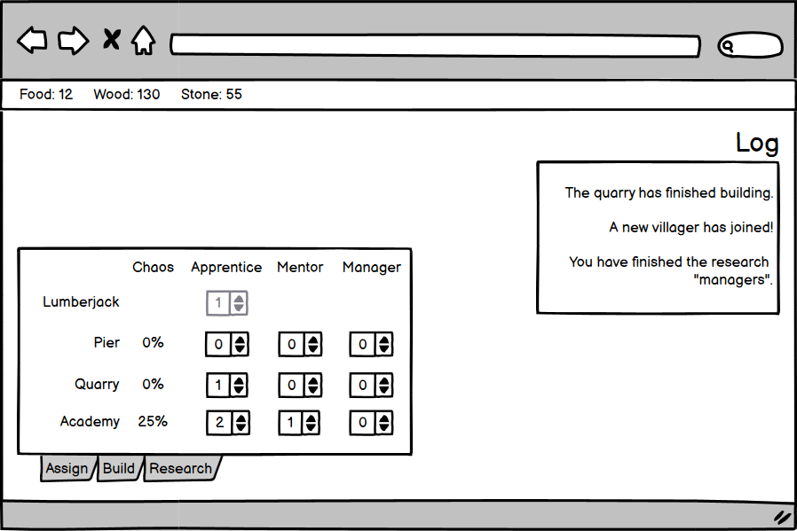
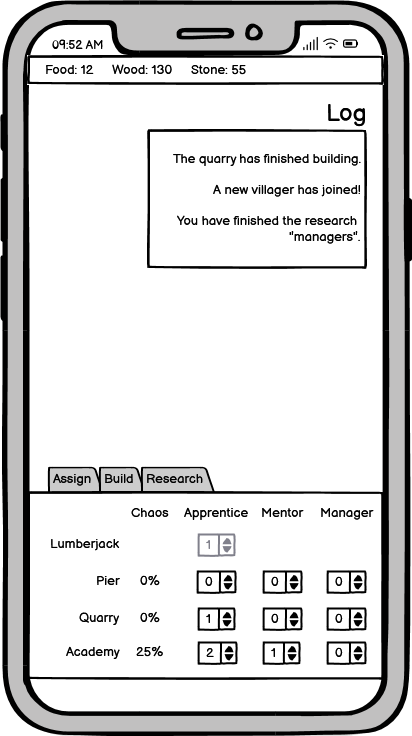
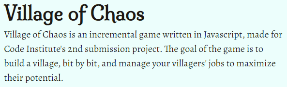

# Village of Chaos - UX design notes

## Motivation

Ever since the the advent of [Cookie Clicker](https://orteil.dashnet.org/cookieclicker/), incremental games have enjoyed a huge rise in popularity, topping the charts of mobile app stores and ruining worker productity worldwide. The simple gameplay makes them appealing to people less skilled at videogames, and they can be created very rapidly with little graphical content by any aspiring game designer. _Village of Chaos_ is a "management" type incremental, where workers can be assigned to automate tasks. However, the driving idea behind this game is that increasing the number of units assigned to the same task doesn't neccessarily result in a speedup, as the team becomes uncoordinated and chaotic. The player will need to research and apply management techniques to keep the team efficient and production high.

## Market research

The incremental game scene is huge, and full of interesting ideas. This is a small sampling of similar browser games:

-   [Kittens Game](https://kittensgame.com/web/)
-   [Trimps](https://trimps.github.io)
-   [Universal Paperclips](https://www.decisionproblem.com/paperclips/index2.html)
-   [CivClicker](https://cheerfulghost.github.io/civ-clicker/index.html)

All of these games start out extremely simple, hiding most of their features and mechanics at first to avoid overwhelming the player with complexity. As certain milestones are reached, the number of available interactible objects increases, letting the player grow their numbers further at the cost of having to wrap their head around more systems.

The visual design is typically extremely simple, mostly text-based, with imagery limited to icons. This is because these games are created by tiny teams, often by a single person, who usually isn't a visual artist. Good UX design is valued, but attractive graphics are not needed to be successful.

These methods are typically used to help present the game data to the player:

-   A section listing all resources, and the speeds at which they're growing,
-   Tabbed interface for switching between sections,
-   Primary method of interaction is pressing buttons to make purchases and other choices,
-   A message log, appended with in-game events as they happen,
-   Elements are hidden or greyed out if they're not relevant right now.

## User stories

> _As someone with free time to spare, I want to play a browser game so that I'm entertained._

-   What kind of game is this?
-   What do the buttons mean?
-   How do I start?
-   What's the ultimate goal?

## Scope

These goals are neccessary for a MVP of the game:

-   Resources:
    -   Food,
    -   Wood,
    -   Stone,
-   Buildings:
    -   Tent (increases villager count),
    -   Pier (increases food),
    -   Quarry (increases stone),
    -   Blacksmith (performs upgrades),
    -   Academy (performs research),
-   Villager roles:
    -   Apprentice (more than one increases chaos if unmanaged),
    -   Mentor (pairs up with an apprentice to manage them),
    -   Manager (doesn't produce, but reduces chaos),
-   A permanently visible listing of all owned resources,
-   Tabbed interface for switching between sections:
    -   A section that lists owned buildings and allows assigning villagers to them,
    -   A section for upgrades,
    -   A section for research,
-   An interactive tutorial explaining the basics to the player,
-   An upgrade which causes the player to win the game when it's complete,
-   Modern, responsive, compliant and accessible design.

These goals aren't neccessary, but would provide additional value:

-   Saving and loading so that the game state survives browser refresh,
-   A graphical view of the village, showing the field in the forest, alongside currently built buildings,
-   Sound effects,
-   Particle and shaking effects.

## Structure

Game interaction is sorted into tabbed sections. Each section serves a single game mechanic, helping the player understand the game more easily. The first tab allows assigning of villagers to buildings, also choosing their roles. The second tab allows crafting, which generally improves production. The last tab is for research, which are late-game upgrades that improve management techniques.

The resource listing, as the most important piece of information for the player, will be visible to the player at all times. A typical option is to float it at the top/bottom of the window, or at the edge of the section navigation. Different approaches might work best on desktop and on mobile. Current income (units per second) will be shown for each resource, so that the player has immedaite feedback on whether their villager assignments are working well.

The player begins the game by gathering food and wood manually, by clicking buttons. This will let them build a tent, inviting their first villagers. All unassigned villagers automatically collect wood. Once assigned to a building, they generate a resource specific to that building. With enough resources, the player can erect more buildings and upgrade them to improve production.

Having two or more stray villagers doing the same task increases that building's chaos meter. Chaos divides the production speed of that resource. It can be avoided by assigning mentor/apprentice pairs, as well as by introducing managers.

Throughout the game, there are multiple references to a monolith looming over the village. The player can interact with the monolith using certain story-relevant upgrades. Buying the last monolith upgrade ends the game. For story-relevant reasons this tears down the DOM, making the game unplayable until the page is refreshed.

Througout the player's first steps, tutorial pop-ups will appear at appropriate times. For example, once the game starts, a pop-up instructs the player to click on gathering buttons to earn resources. When the player assigns two villagers to a single job, a pop-up will let them know about the chaos system, etc.

## Wireframe

As the game evolved, the design slowly diverged from this initial wireframe into one with less floating sections and more concrete panels. This helped avoid overlap between elements at all sorts of screen sizes.

In particular, the header is now floating on mobile, and part of the sidebar on desktop. The tabbed interface is always part of the sidebar. The log window is floating, but can be collapsed to save space.

## Design language

As this project was focused on the functionality rather than design, the primary priority was clarity of UX rather than attractive visuals. All site elements were laid out with placeholder design as the game was being developed until the interactions were satisfactory. The purely visual aspects, like color scheme followed after. Time also permitted to add flavor images to the site background.

The color palette was extracted from the background image to make the game feel consistent. The colors are bright, and are used mostly as backgrounds for dark text.

Color palette hex codes

-   Text color: `#201711`,
-   Primary color: `#768c38`,
-   Primary color highlight: `#b3c55a`,
-   Secondary color: `#349097`,
-   Secondary color highlight: `#4dd7e1`,
-   Active element color: `#e7fffc`,
-   Inactive element color: `#a8bab8`,
-   Resource color (wood): `#5a2800`,
-   Resource color (food): `#00444a`,
-   Resource color (stone): `#37173c`.

The goal for the fonts was a literary feel, but also exaggerated and slightly distorted to accent the "chaos" elements, which change in meaning as the game progresses. The heading choice was [Milonga](https://fonts.google.com/specimen/Milonga), with strong flowing curves that give off a "fantasy" vibe. It is accompanied by [Alegreya](https://fonts.google.com/specimen/Alegreya) for primary copy. It's a bookish font on the surface, but closer inspection reveals slightly off-angle lines and discrepancies from the metric.

The log window uses [Fira Mono](https://fonts.google.com/specimen/Fira+Mono). A monospace font was needed, and this one features the most gratuituous serifs and embellishments.
