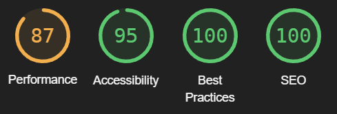

# Village of Chaos - Testing notes

## Validation

All project files validated successfully with the [HTML and CSS checker](https://validator.w3.org/nu), aside from caveats documented below:

-   HTML files have information-level alerts about redundant slash in self-closing tags. These are present because the _Prettier_ formatting tool adds the slashes, without an option to turn it off. There is a [long standing issue](https://github.com/prettier/prettier/issues/5246) about this.
-   HTML files have alerts about `<section>` tags with no heading inside. This is a warning-level alert, and I believe it's justified by the fact that the HTML serves a game rather than a document or website. They are used for meaningful sections of the content, and their purpose is explained in a different way - via Javascript UX rather than static headings.

The Javascript files have ES6 strict mode enabled, and generate no warnings or errors in browser console.

The Lighthouse report shows a green score in every category besides performance:

The performance score drops because of layout shift during load. This is caused by the world image being shifted by the Javascript after page load. This is a false positive, because it's used purely as background content, and doesn't affect page readability

The accessibility score is dropped by the "Reset" button in the header having bad contrast. This is purposeful - the button has a harsh red color as a warning, because it performs a permanently destructive operation.
