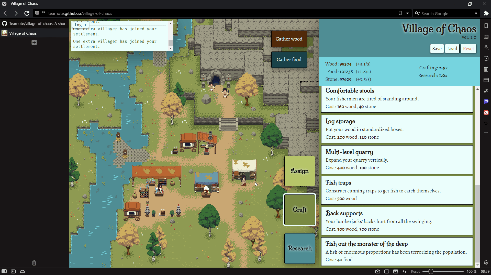
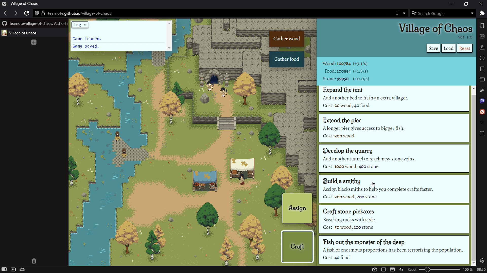

# Village of Chaos - Testing notes

## Validation

All project files validated successfully with the [HTML and CSS checker](https://validator.w3.org/nu), aside from caveats documented below:

-   HTML files have information-level alerts about redundant slash in self-closing tags. These are present because the _Prettier_ formatting tool adds the slashes, without an option to turn it off. There is a [long standing issue](https://github.com/prettier/prettier/issues/5246) about this.
-   HTML files have alerts about `<section>` tags with no heading inside. This is a warning-level alert, and I believe it's justified by the fact that the HTML serves a game rather than a document or website. They are used for meaningful sections of the content, and their purpose is explained in a different way - via Javascript UX rather than static headings.

The Javascript files have ES6 strict mode enabled, and generate no warnings or errors in browser console.

The Lighthouse report shows a green score in every category besides performance:

The performance score drops because of layout shift during load. This is caused by the world image being shifted by the Javascript after page load. This is a false positive, because it's used purely as background content, and doesn't affect page readability.

The accessibility score is dropped by the "Reset" button in the header having bad contrast. This is purposeful - the button has a harsh red color as a warning, because it performs a permanently destructive operation.

## Testing

The scenarios below will test the majority of the game functions:

### Resource gathering

Procedure:

1.  Start the game,
2.  Press the Gather wood and Gather food buttons,
3.  Observe the effect on resource count.

Expected:

Pressing Gather wood increases wood amount by one, and pressing Gather food increases food amount by one.

Actual:

The buttons behave as expected.

### Tab switching

Procedure:

1.  Play through the game,
2.  Once the Craft and Assign tabs are unlocked, click each tab button,
3.  Once the Research tab is unlocked, click each tab button.

Expected:

Each tab button activates the relevant tab in the sidebar.

Actual:

The buttons behave as expected.

### Layout responsiveness

Procedure:

1.  Play through the game until all features are unlocked (the [cheat code](../README.md#important-notes) can be used to speed it up,)
2.  Save the game,
3.  Use the browser developer tools to preview the game at various sizes.

Expected:

At any supported size the game has no layout overlap or text overflow, and any containers that overflow their contents can be scrolled.

Actual:

The site is responsive, as per the screenshots above, showcasing both desktop landscape and mobile portrait mode. Desktop portrait is also working, and mobile landscape is not supported as per the related [bug](../README.md#bugs).

### Resource production

Procedure:

1.  Play through the game until you unlock all features,
2.  Observe resource production as villagers are assigned to jobs,
3.  Observe the effect of unassigned villagers on wood production,
4.  Observe the difference between villager production and mentor production,
5.  Observe the effect of chaos on production,
6.  Assign managers to reduce chaos.

Expected:

All unassigned villagers produce wood. Production of the relevant resource increases as villagers are assigned. Mentors have higher production than villagers. With more than 1 villager assigned, chaos increases. It reduces the total production amount when present. Assigning managers reduces chaos, increasing production again.

Actual:

The expected behavior happens.

### Major upgrades

Procedure:

1.  Start playing the game,
2.  Unlock major upgrades - building a tent, pier, quarry, smithy, academy.

Expected:

When crafted, these upgrades unlock the relevant part of the interface, as well as displaying the building in the game world.

Actual:

The expected behavior happens.

### Minor upgrades

Procedure:

1.  Start playing the game,
2.  Unlock a minor upgrade - improving a job, or getting a one-time resource boost.

Expected:

The upgrade performs the effect that is suggested by the description, either providing a permanent boost to a building's production speed, or incrementing resources.

Actual:

The expected behavior happens.

### Log window

Procedure:

1.  Start the game,
2.  Buy a few upgrades,
3.  Observe the log window as they are bought,
4.  Expand the log window to full size and restore it,
5.  Repeat point 4 on a simulated mobile device.

Expected:

Each upgrade bought prints a line to the log. The line has a vertical separator above, distinguishing it from previous messages. The line appears at the bottom. If the log window overflows, it can be scrolled, and if scrolled entirely to the bottom, the new line is scrolled into view automatically. The log can be expanded and restored, and in expanded form it is drawn on top of all other interface elements.

Actual:

The expected behavior happens.

### Job assignment

Procedure:

1.  Play the game until all features are unlocked,
2.  Assign and unassign a villager to/from every possible job and role,
3.  Try unassigning from a role with 0 assignments,
4.  Try assigning when there are 0 villagers remaining.

Expected:

All assignments add one villager to the role, and all unassignments remove one villager from the role. Unassignment fails quietly if there are already 0 assigned villagers, and assignment fails quietly if there are no villagers left to assign (0 lumberjacks.)

Actual:

The expected behavior happens.

### Tutorial pop-ups

Procedure:

1.  Start the game,
2.  Trigger the first tutorial pop-up automatically at start-up,
3.  Trigger further pop-ups every time a new building or feature is unlocked.

Expected:

Every new feature causes a pop-up to show up on the screen, with a small delay. This covers the whole game window with a transparent overlay. The only objects above the overlay are the pop-up and a highlighted object. Only the pop-up can be interacted with; the rest of the page becomes unusable while the pop-up is shown, even the highlighted element.

Actual:

The expected behavior happens successfully.

### Story shroud

Procedure:

1.  Start the game,
2.  Play until the first monolith upgrade is available,
3.  Buy and complete the upgrade.

Expected:

At the start of the game, a story overlay shows an introduction. After buying a monolith upgrade, the same shroud appears with different text.

Actual:

Expected behavior happens successfully.

## User stories study

In the design phase, we [established](DESIGN.md#user-stories) the expected user-base and what kinds of questions they might have when playing the game. We will check if their questions are answered by the finished project.

| Question                   | Answered? | How?                                                                                                                                                                                            |
|----------------------------|-----------|-------------------------------------------------------------------------------------------------------------------------------------------------------------------------------------------------|
| What kind of game is this? | Yes       | Answered by the description meta, which the user is likely to see in search results or share widget                                                                                             |
| What do the buttons mean?  | Yes       | Answered by the tutorial system, which explains each button as it becomes available                                                                                                             |
| How do I start?            | Yes       | Answered by the tutorial system, which provides guidance throughout the first steps                                                                                                             |
| What's the ultimate goal?  | Yes       | The goal appears to be to develop your village, motivated by new graphics appearing on every major upgrade. However, the focus begins to shift by the endgame to the mysterious Monolith entity |
